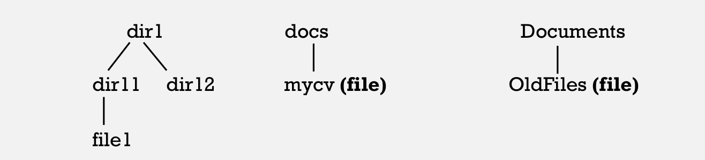

## Q1: List three Linux Distribution.
* Ubuntu
* Debian
* Redhat

## Q2: What is man command used for?
man finds and displays the manual pages of a given command, function or utility if exist.

## Q3: what is the difference between rm and rmdir?
* rm is used for removing files or directories.
* rm is only used for removing empty directories.

## Q4: creat the following hierarchy under home directory

'''mkdir ~/dir1
mkdir ~/dir1/dir11
touch ~/dir1/dir11/file1
mkdir ~/dir1/dir12

mkdir ~/docs
touch ~/docs/mycv

touch ~/Documents/OldFiles'''

### a. Remove dir11 with 'rmdir' in one-step. What did you notice? And how did you overcome that?
Can not removing dir11 with 'rmdir' in one-step as it is not an empty directory, I overcame that by using 'rm -r' command instead.
### b. Then remove OldFiles using rmdir –p command. State what happened to the hierarchy (Note: you are in your home directory).
Nothing happend as OldFiles is not a directory.
### c. The output of the command pwd was /home/user. Write the absolute and relative path for the file mycv
* relative path is ./docs/mycv
* abssolute path is /home/user/docs/mycv

## Q5: Copy the /etc/passwd file to your home directory making its name is mypasswd
'cp /etc/passwd ~/mypasswd'

## Q6: Rename this new file to be oldpasswd
'mv ~/mypasswd ~/oldpasswd'

## Q7: You are in /usr/bin, list four ways to go to your home directory
1. 'cd ../../home/user'
2. 'cd ~'
3. 'cd /home/user'
4. 'cd'

## Q8: List Linux commands in /usr/bin that start with letter w
'ls w*'

## Q9: What command type are used for?
'type' command is used to know if a certain command is a built-in command or external command and the path of its binary if it is an external command.

## Q12: What is the usage of apropos command?
'aprops' is a command used for searching the manual page names and descriptions.

